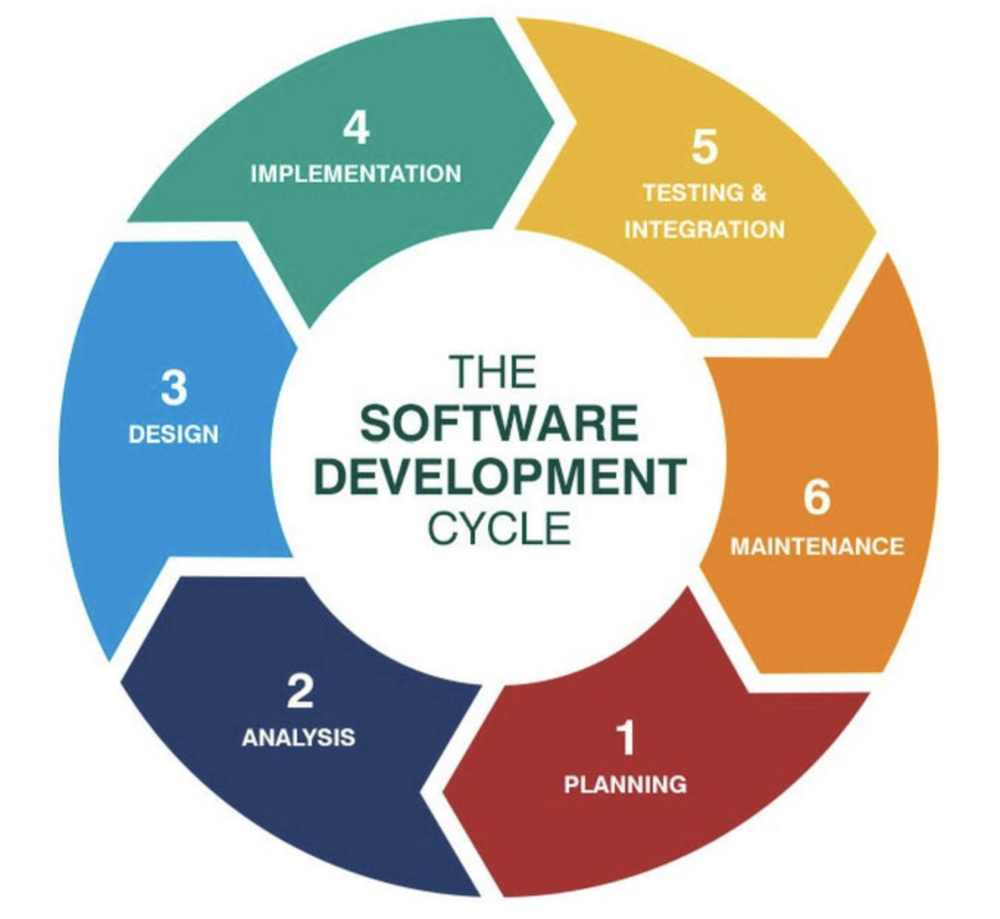
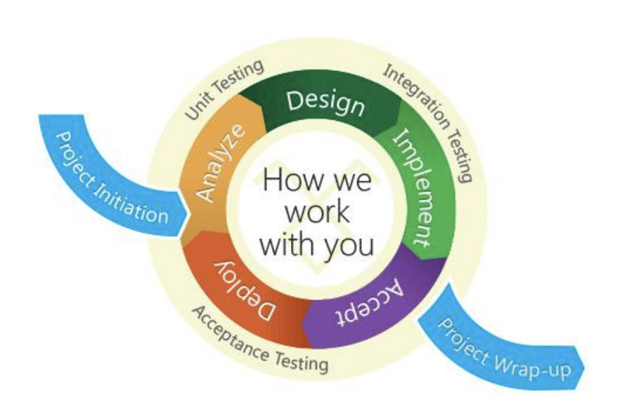
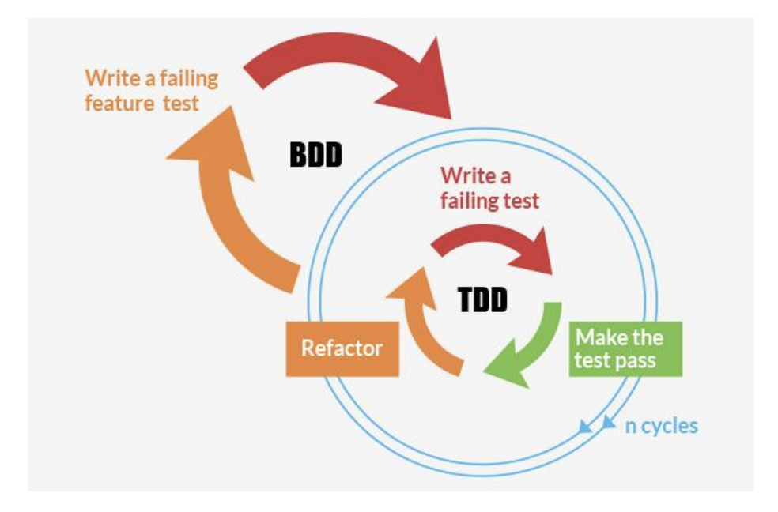
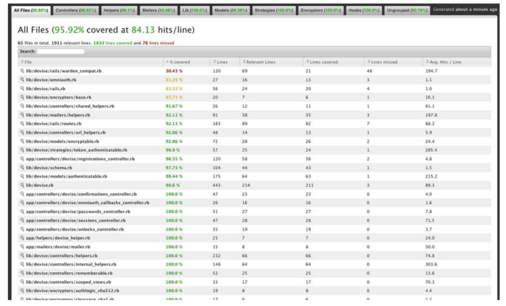
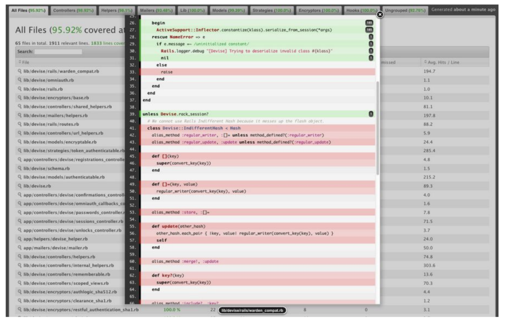

# Testing introduction

## What is testing



➢ A part of software development process

➢ To assess the feature of software item

➢ Assesses the quality of the product

    Testing is a verification and validation process




## Why testing?

➢ Help you develop the behaviors within your app

➢ Help to examine change the software engineering process to reduce faults in the system

➢ The software is correct with requirement

## Why Write Tests for your Rails Applications?

Follow <https://guides.rubyonrails.org/testing.html>

> Rails makes it super easy to write your tests. It starts by producing skeleton test code while you are creating your models and controllers.
> 
> By running your Rails tests you can ensure your code adheres to the desired functionality even after some major code refactoring.
> 
> Rails tests can also simulate browser requests and thus you can test your application's response without having to test it through your browser.

## What is TDD, BDD



### TDD (Test Driven Development)

Test-Driven Development (TDD) is an approach to automated software testing that involves writing a failing test before writing the production code to make it pass. TDD helps you develop a robust test suite to catch bugs, as well as guiding you to more modular, flexible code.

➢ Mostly written by Developer

➢ Written to test each unit of code(Unit Tests) and before writing any code

➢ Design low level scenario

### BDD (Behavior-drivent Development)

Behavior-Driven Development (BDD) is a practice in software development, which defines behavioral specification of software to be developed, and implements the specification as automated test cases, before starting to develop the software.

➢ Can be written by Stakeholders or Non technical person

➢ Readable description of how the product behaves

➢ Design High level scenario to test expectation from software

### TDD/BDD guideline

The following is sample high-level workflow for TDD/BDD style. In includes two big phases, specification and implementation

#### Specification:

1. Design classes and functions
2. Create application skeletons of the classes and functions
3. Describe behavioral specification in brief as comments (or doc comment - depending on each language style) of the classes and functions in the application skeletons
4. Create test skeletons for the classes and functions
5. Implement tests for the test skeletons

#### Implementation:

1. Implement application for the application skeletons
2. Fix application until all tests passed
3. Refactor application to fix code quality issues
4. Repeat steps 2 and 3 until all code quality issues solved

## What is Minitest

Described in official site <https://github.com/seattlerb/minitest>

> minitest/test is a small and incredibly fast unit testing framework. It provides a rich set of assertions to make your tests clean and readable.
> 
> minitest/spec is a functionally complete spec engine. It hooks onto minitest/test and seamlessly bridges test assertions over to spec expectations.
> 
> minitest/benchmark is an awesome way to assert the performance of your algorithms in a repeatable manner. Now you can assert that your newb co-worker doesn't replace your linear algorithm with an exponential one!
> 
> minitest/mock by Steven Baker, is a beautifully tiny mock (and stub) object framework.
> 
> minitest/pride shows pride in testing and adds coloring to your test output. I guess it is an example of how to write IO pipes too. :P
> 
> minitest/test is meant to have a clean implementation for language implementors that need a minimal set of methods to bootstrap a working test suite. For example, there is no magic involved for test-case discovery.

Comparing to rspec:

> rspec is a testing DSL. minitest is ruby.
> 
> -- Adam Hawkins, "Bow Before MiniTest"
> minitest doesn't reinvent anything that ruby already provides, like: classes, modules, inheritance, methods. This means you only have to learn ruby to use minitest and all of your regular OO practices like extract-method refactorings still apply.

## What is RSpec

➢ Behaviour Driven Development for Ruby

➢ Is a meta-gem: depends on the rspec-core, rspec-expectations and rspec-mocks gems

➢ https://github.com/rspec/rspec

➢ Example

```ruby
# spec/models/post_spec.rb
require "rails_helper"

RSpec.describe Post, type: :model do
    context "with 2 or more comments" do
        it "orders them in reverse chronologically" do
            post = Post.create!
            comment1 = post.comments.create!(body: "first comment")
            comment2 = post.comments.create!(body: "second comment")
            expect(post.reload.comments).to eq([comment2, comment1])
        end
    end

    context "with valid attributes" do
        it "creates the vehicle" do
            post :create, vehicle: attributes_for(:vehicle), format: :json
            expect(Vehicle.count).to eq(1)
        end

        it "responds with 201" do
            post :create, vehicle: attributes_for(:vehicle), format: :json
            expect(response).to have_http_status(201)
        end
    end
end
```

```ruby
# spec/views/products/_product.html.erb_spec.rb
describe "products/_product.html.erb" do
    context "when the product has a url" do
        it "displays the url" do
            assign(:product, build(:product, url: "http://example.com")
            render
            expect(rendered).to have_link "Product", href: "http://example.com"
        end
    end

    context "when the product url is nil" do
        it "displays "None"" do
            assign(:product, build(:product, url: nil)
            render
            expect(rendered).to have_content "None"
        end
    end
end
```

## Minitest or RSpec?

Here are fews differences between the two frameworks, credit <https://dev.to/vinistock/comment/bgd5>

### Rspec
#### Pros

- Test are very easy to read and figure out what they are trying to verify
CLI is simple. You can easily run a specific example (even if the example is defined using metaprogramming)
- The tools for stubbing and verifying method calls are simple and intuitive
- Creating a matrix of different scenarios is easy through shared contexts, lets and the example hooks (before, after, around)

#### Cons

- Takes longer to learn the DSL since it is not pure Ruby
- Tests take longer and have a larger memory footprint
- Requires libraries for doing things that come out of the box with minitest (such as fixtures)

### Minitest

#### Pros

- Runs much faster than rspec
- Tests are written in pure Ruby
- Outputs not only number of examples, but also number of assertions
- Comes with fixtures and many Rails assertions out of the box

#### Cons

- CLI isn't the best. Hard to run a specific example
- Stubbing or verifying method calls is not as intuitive as in rspec
- Harder to create a matrix of scenarios since you cannot nest contexts as in rspec

### In Rails application

Rails generates minitest by default when creating new application

```bash
rails generate model article title:string body:text
...
create  app/models/article.rb
create  test/models/article_test.rb
create  test/fixtures/articles.yml
...
```

```ruby
# test/models/article_test.rb
require 'test_helper'
 
class ArticleTest < ActiveSupport::TestCase
    test "should not save article without title" do
        article = Article.new
        assert_not article.save
    end
end
```

Run the tests

```bash
$ rails test test/models/article_test.rb:6
Run options: --seed 44656
 
# Running:
 
F
 
Failure:
ArticleTest#test_should_not_save_article_without_title [/path/to/blog/test/models/article_test.rb:6]:
Expected true to be nil or false
 
rails test test/models/article_test.rb:6
 
Finished in 0.023918s, 41.8090 runs/s, 41.8090 assertions/s.
 
1 runs, 1 assertions, 1 failures, 0 errors, 0 skips
```


## RSpec tools

### FactoryBot

➢ A library for setting up Ruby objects as test data

➢ Support for multiple factories for the same class (user,
admin_user, and so on)

➢ https://github.com/thoughtbot/factory_bot

➢ Example

```ruby
# This will guess the User class
FactoryBot.define do
    factory :user do
        first_name "John"
        last_name "Doe"
        admin false
    end

    # This will use the User class (Admin would have been guessed)
    factory :admin, class: User do
        first_name "Admin"
        last_name "User"
        admin true
    end
end
```

### Faker

➢ A library for generating fake data such as names, addresses, and phone numbers

➢ https://github.com/ffaker/ffaker

➢ Example

```ruby
FFaker::Name.name #=> "Christophe Bartell"
FFaker::Internet.email #=> "kirsten.greenholt@corkeryfisher.info"

# Faker in FactoryBot
FactoryBot.define do
    factory :user do
        name { FFaker::Name.name }
        email { FFaker::Internet.email }
    end
end
```

### SimpleCov

➢ A code coverage analysis tool for Ruby

➢ https://github.com/colszowka/simplecov

➢ Example

- All files

  

- File coverage detail
  
  

