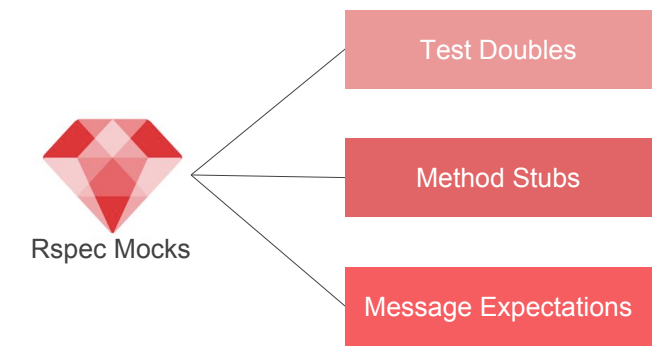
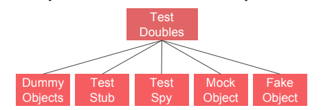

# RSpec mockings

## The problem

Tests need to be:
- Repeatable. If you are to automate a test, your test cases should
return the same results every time so you can verify those results.
- Fast. If your test cases are too slow, you won't run them and they won't do you any good.
- Simple. If tests are too hard to write, you won't write them.

## What is RSpec mocks

Rspec-mocks helps to control the context in a code example by letting you set known return values, fake implementations of methods, and even set expectations that specific messages are received by an object.


## Basic methods



### Test Doubles



Use the double method, passing in an optional identifier, to create one:
    ```ruby
    book = double("book")
    ```

That your doubles resemble an existing object in your system:
    ```ruby
    book = instance_double( "Book", pages: 250, author: “Steven Job” )
    ```

- Dummy: A pure placeholder object with no behaviour (it doesn’t respond to any messages). This is used when a method requires an argument but doesn’t interact with it in a specific test.
- Stub: An object providing canned responses to specific messages.
- Spy: An object that records all messages it receives (assuming it is allowed to respond to them), allowing the messages it should have received to be asserted at the end of a test.
- Mock: An object that is given a specification of the messages that it must receive (or not receive) during the test if the test is to pass.
- Fake: A replacement object with real behaviour, but taking shortcuts that are helpful for testing purposes (a good example is using an in-memory database for faster testing of database-dependent code).
- A method stub is an implementation that returns a pre-determined value.
- Method stubs can be declared on test doubles or real objects using the same syntax. rspec-mocks supports 3 forms for declaring method stubs:
    ```ruby
    allow(book).to receive(:title) { "The RSpec Book" }
    allow(book).to receive(:title).and_return( "The RSpec Book" )
    allow(book).to receive_messages(title: "The RSpec Book" ,
    subtitle: "Behaviour-Driven Development with RSpec" )
    ```
- You can also use this shortcut, which creates a test double and declares a
method stub in one statement:
    ```ruby
    book = double("book", :title => "The RSpec Book" )
    ```
- A message expectation is an expectation that the test double will receive
a message some time before the example ends.
- In RSpec, we create a message expectation using the should_receive()
method, like this.
    ```ruby
    customer = double('book')
    customer.should_receive(: title).and_return('The Rspec Book' )
    ```

## Introduction to mock and stub

### What is Mock?

- A mock object is a fake object in the system that decides whether the unit test has passed or failed.
- If does so by verifying whether the object under test interacted as expected with the fake object.
What is Stub?
- Provide answer to the methods which are called on them.
- Return hard coded information in order to reduce test dependencies and avoid time consuming operations.

### Create a Mock

You can create a mock in any specification (or set-up) using:

```ruby
mock(name, options={})
```

The optional options argument is a Hash. Currently the only supported option is `:null_object`. Setting this to true instructs the mock to ignore any messages it hasn’t been told to expect and quietly return itself. For example:
```ruby
mock("book", null_object: true)
```

### Create a Stub

You can create a stub in any specification (or set-up) using:
```ruby
stub(name, stub_methods_and_values_hash)
```

For example, if you wanted to create an object that always returns "This is
Rspec book" to "title_book" you would do this:
```ruby
stub("The Rspec book" , title_book: "This is Rspec book" )
```

## Benefit of RSpec mocks

There are a couple of reasons why you may decide to use mock:
- As a replacement for objects that don't exist yet.
- When you are working with objects which return non-deterministic values or
depend on an external resource, e.g. a method that returns an RSS feed from
a server.
- To avoid setting up a complex scheme of data or dependency objects in
order to write a test.
- To avoid invoking code which would degrade the performance of the test,
while at the same time being unrelated to the test you are writing.

## Examples

Assuming you have Ruby and Ruby on Rails set up, we can start by creating our Rails application. 
```bash
rails new mock-rspec-in-ruby
```

Now, let's add our user model and tests by using the Rails generator:
```bash
rails g model user name:string
```

```bash
# Output
Running via Spring preloader in process 10806
    invoke active_record
    create db/migrate/20170901064302_create_users.rb
    create app/models/user.rb
    invoke test_unit
    create test/models/user_test.rb
    create test/fixtures/users.yml
```

Next, let's create the model for descriptions which has a reference to the user model: 
```ruby
rails g model description working_at:date user:references
```

```bash
# Output
Running via Spring preloader in process 10890
    invoke active_record
    create db/migrate/20170901064958_create_descriptions.rb
    create app/models/description.rb
    invoke test_unit
    create test/models/description_test.rb
    create test/fixtures/descriptions.yml
    Then, migrate the database:
    rake db:migrate
```

Then, migrate the database:
```bash
rake db:migrate
```

Finally, let's create a service which creates and manages subscriptions.
Start by adding a reference from User to Description.
```ruby
class User < ApplicationRecord
    has_one :description
end
```

Now, let's add our description service tests. To keep things simple, we don't test that the working_date attribute is always correct.

```ruby
# test/services/description_service_test.rb
require "test_helper"

class DescriptionServiceTest < ActiveSupport::TestCase
    test "#create_or_extend new description" do
        user = users :no_des
        description_service = DescriptionService.new user
        assert_difference "Description.count" do
            assert description_service.apply
        end
    end

    test "#create_or_extend existing description" do
        user = users :one
        description_service = DescriptionService.new user
        assert_no_difference "Description.count" do
            assert description_service.apply
        end
    end
end
```

Let's also add a user fixture for the user which has no subscriptions. Add the
following two lines to the user fixture file:
Example: How to use Mock and Stub in Ruby

```yml
# test/fixtures/users.yml
one:
    name: My String
two:
    name: My String
no_des:
    name: No Description
```

Now, let's make our test pass by adding `DescriptionService`.

```ruby
# app/services/description_service.rb
class DescriptionService
    DESCRIPTION_LENGTH = 1.month

    def initialize user
        @user = user
    end

    def apply
        if Description.exists? user_id: @user.id
            extend_description
        else
            create_description
        end
    end

    private

    def create_description
        description = Description.new(
        user: @user,
        working_at: DESCRIPTION_LENGTH.from_now
        )
        description.save
    end

    def extend_description
        description = Description.find_by user_id: @user.id
        description.working_at = description.working_at + DESCRIPTION_LENGTH
        description.save
    end
end
```

Now, run the tests to make sure everything is passing
```bash
rake
Run options: --seed 20193
# Running:

..
Finished in 0.171254s, 11.6785 runs/s, 23.3571 assertions/s.
2 runs, 4 assertions, 0 failures, 0 errors, 0 skips
```

Note that `app/services` and `test/services` do not exist by default so you will have to create them.
We're now ready to add some functionality, which we can benefit from by using mocks and stubs in the tests